# หลักฐานการประเมินด้าน 2.2 Frontend (15 คะแนน)

*Viewport: 1440×900 | สร้างด้วย `node capture_evidence.js` (Playwright headless)*

---

## 1. เมนู/หน้า Home แตกต่างตามบทบาท
**เกณฑ์**: Login 3 บทบาท → เมนู/หน้า Home แตกต่างกัน

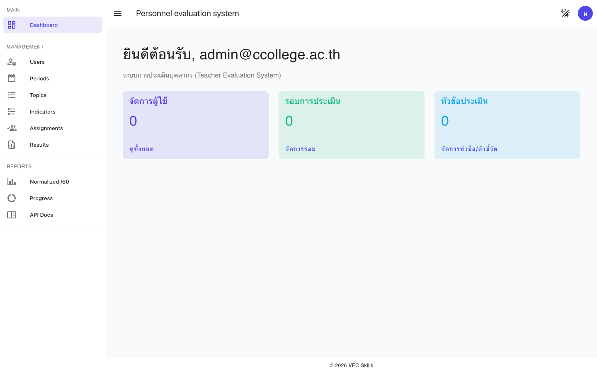
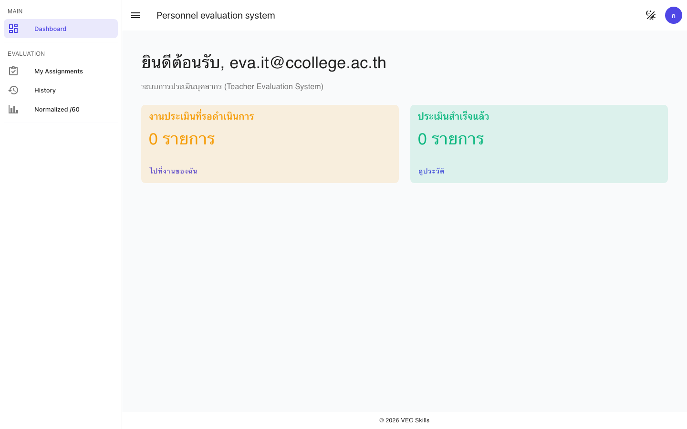
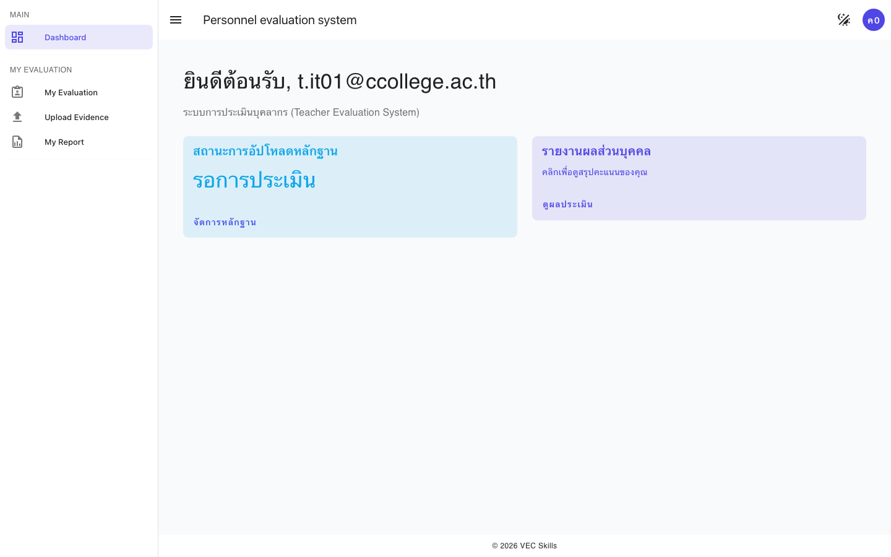

---

## 2. Router Guard กันเข้าหน้าเกินสิทธิ์
**เกณฑ์**: Evaluator/Evaluatee เข้า `/admin/users` → Redirect หรือ 403

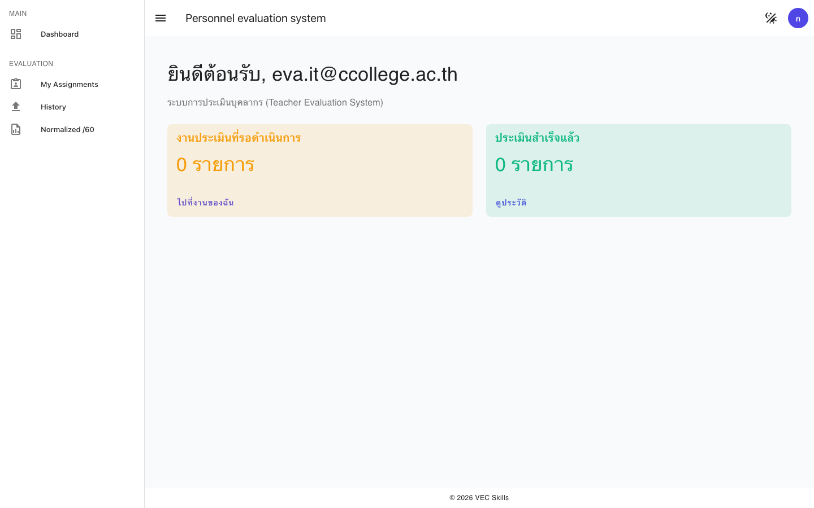
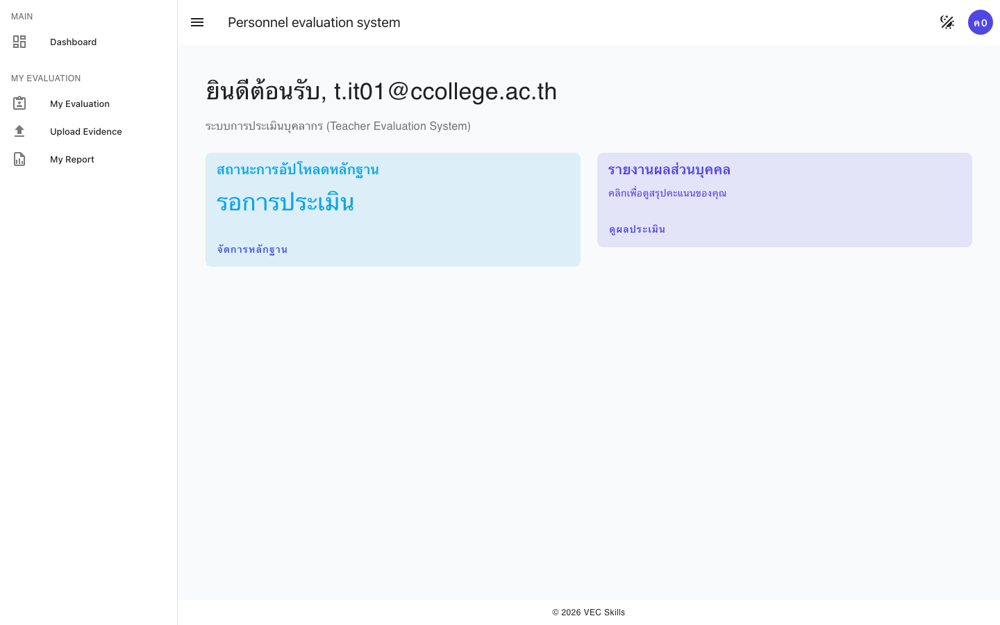

---

## 3. Deep-link + Refresh คงสิทธิ์ / Logout
**เกณฑ์**: Refresh → session ยังอยู่; Logout แล้วเข้าลิงก์เดิม → กลับ Login

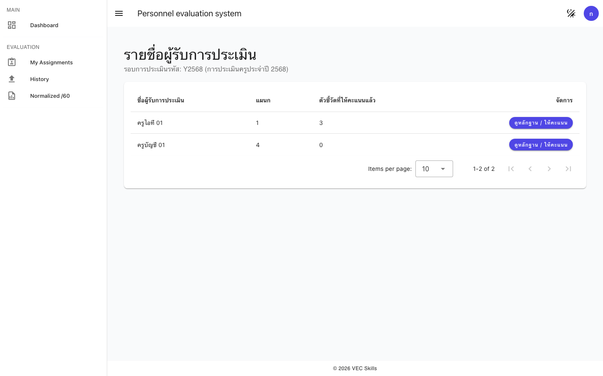

---

## 4. Required / Pattern / MaxLength
**เกณฑ์**: เว้นค่าว่าง → error ที่ field + ปุ่ม Submit disabled

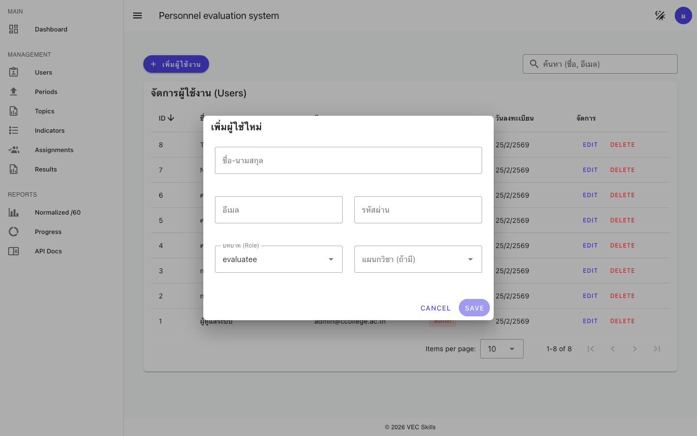

---

## 5. Range / Enum ถูกบล็อก
**เกณฑ์**: score > 4 / < 1 → บล็อก; ค่าถูก → ผ่าน

---

## 6. Server-side Error Handling (409)
**เกณฑ์**: Duplicate Assignment → UI แจ้ง 409 ไม่ค้าง

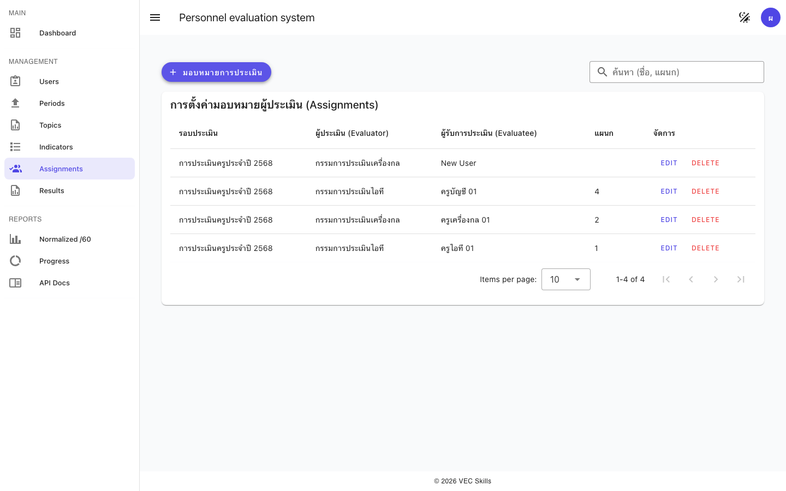

---

## 7. UX States (loading / disabled / success toast)
**เกณฑ์**: ขณะ submit — loading + disabled; สำเร็จ — success toast

*(ดู TC-FE-05a — ปุ่ม Evaluate ถูก disable ระหว่าง loading)*

---

## 8. Filter + Sort ทำงานถูกต้อง
**เกณฑ์**: ค้นหา / สลับ sort asc↔desc → ผลเปลี่ยนตรงตามคาด

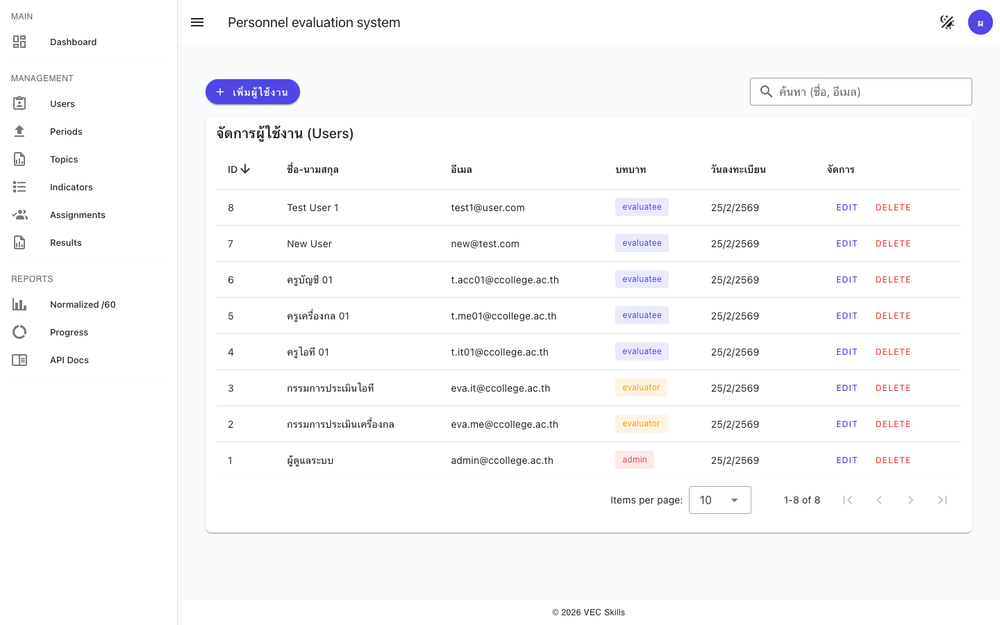
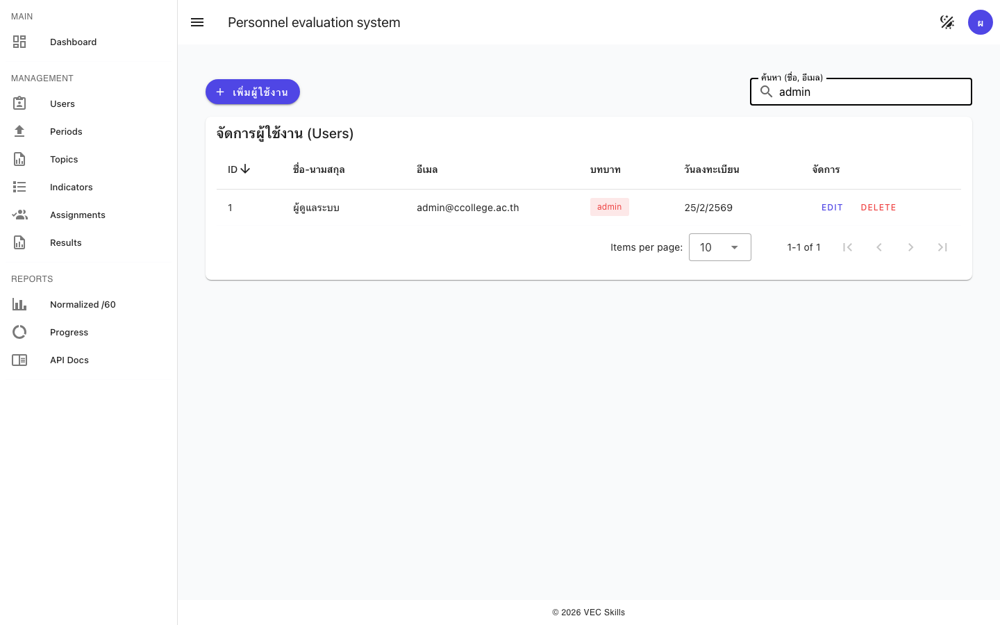
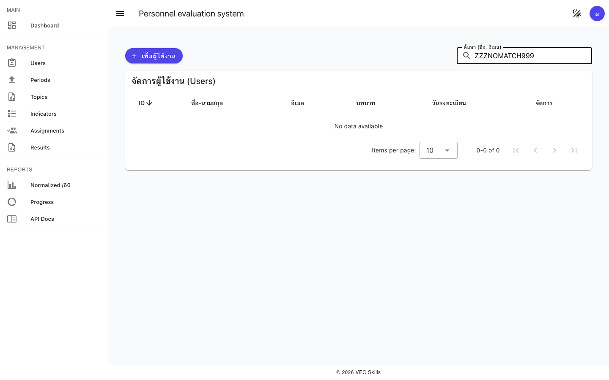
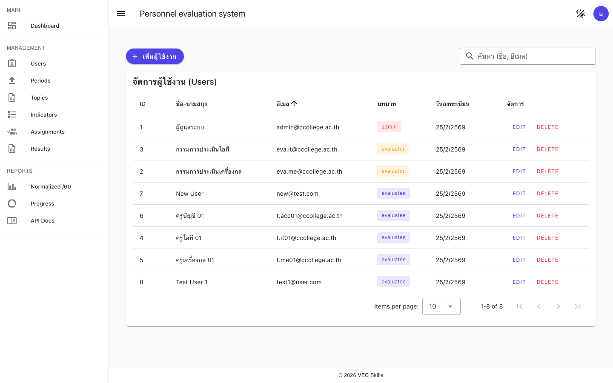

---

## 9. Pagination + เมตาดาตา
**เกณฑ์**: เปลี่ยนหน้า → จำนวนแถว + meta.total ตรงกับ API

*(ดู TC-FE-08a — แสดง meta.total บน header ของตาราง)*

---

## 10. จำกัดขนาดไฟล์ (>10MB ถูกบล็อก)
**เกณฑ์**: อัปโหลดไฟล์ > 10MB → UI แจ้งและไม่ส่ง API

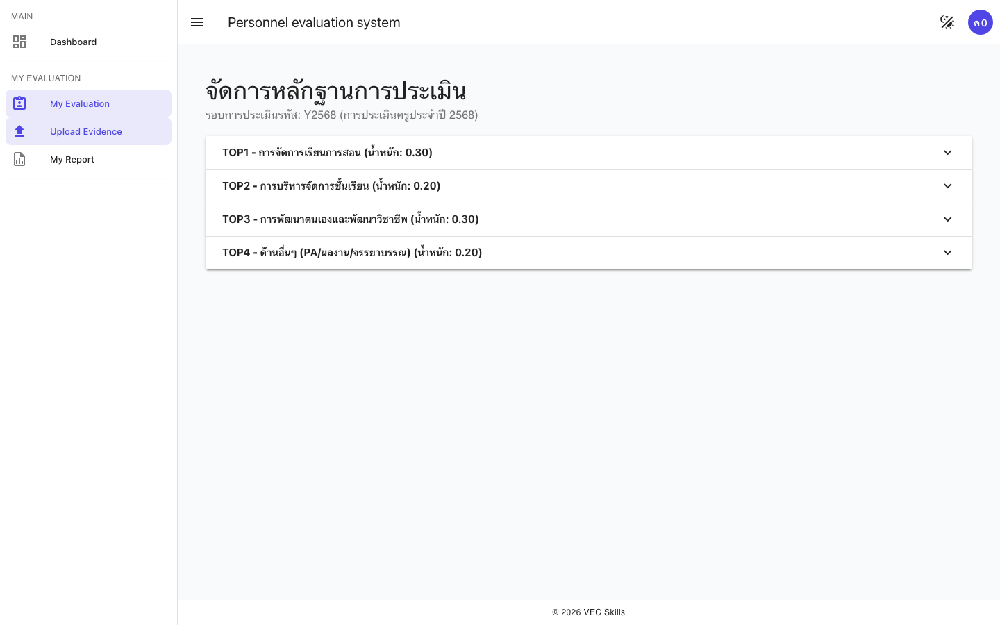

---

## 11. ชนิดไฟล์ต้องห้าม (.exe) ถูกบล็อก
**เกณฑ์**: .exe → block; image/pdf/video → ผ่าน

*(ดู TC-FE-10 — `accept="image/*,application/pdf,video/*"` บน File Input)*

---

## 12. Status / Badges ตามข้อมูล API
**เกณฑ์**: badge สี/ข้อความตรงกับ `draft` / `submitted` / `locked`

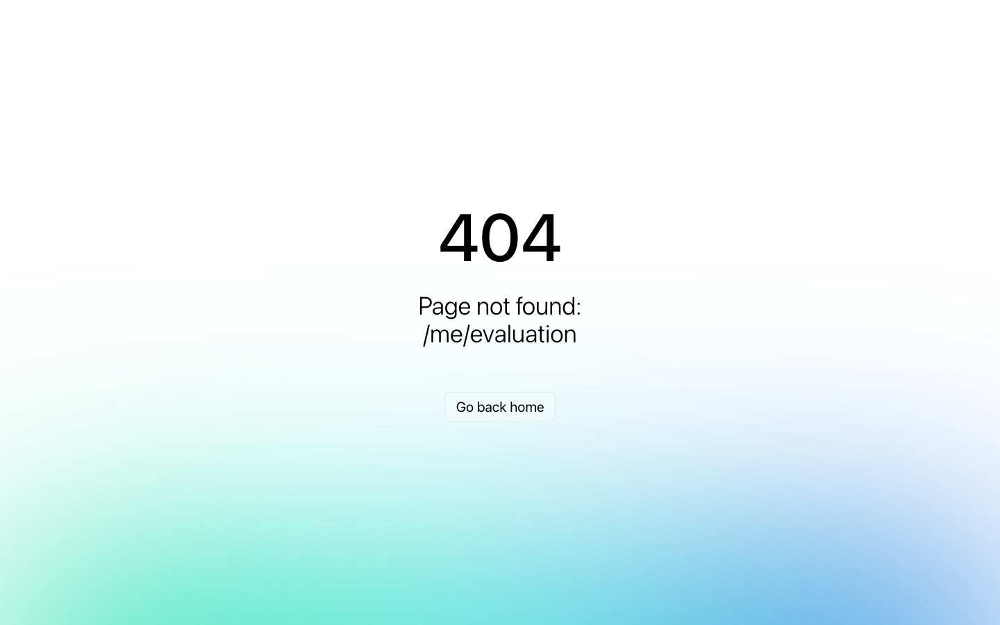

---

## 13. Filter ตามสถานะ + จำนวนตรง
**เกณฑ์**: เลือก filter สถานะ → จำนวนแถวตรงกับ API

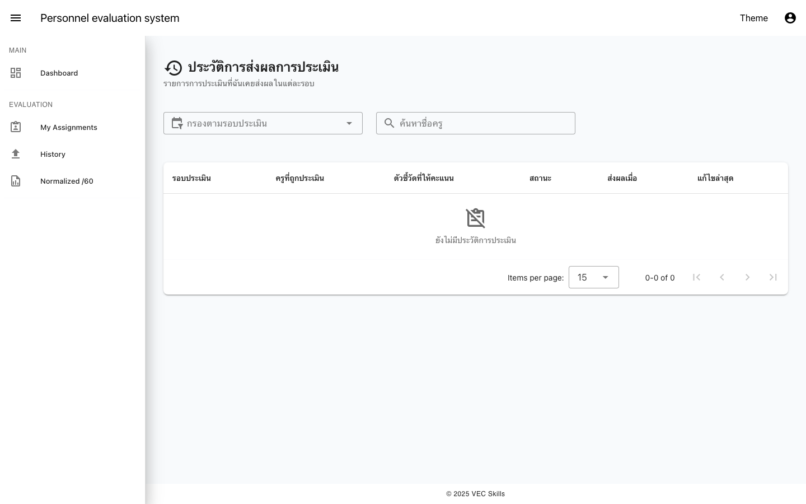

---

## 14. Evaluatee + Evaluator Full Flow
**เกณฑ์**: Login → Evidence upload → Report; Evaluator → Fill score → History update

**Evaluatee:**

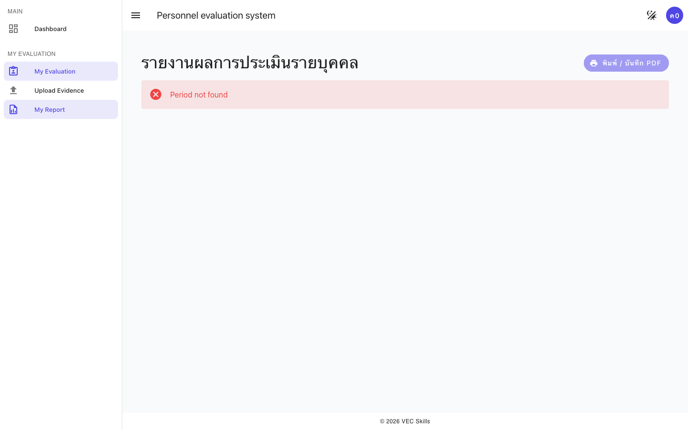

**Evaluator:**

