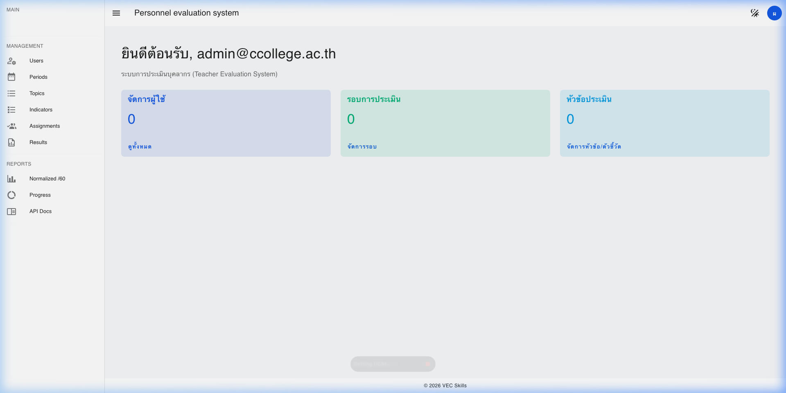
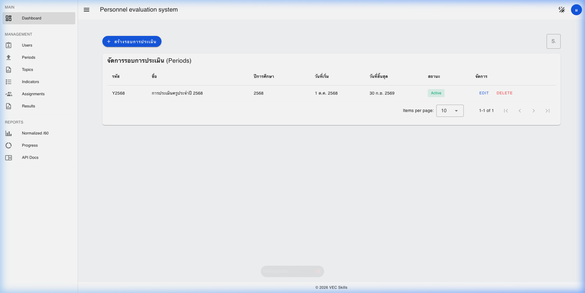

# หลักฐานการทดสอบ Frontend (15 คะแนน)

เอกสารนี้รวบรวมหลักฐานและภาพหน้าจอจากการทดสอบ Web UI ด้วย Automated Actions 
อิงตามแผนการทดสอบ `TC-FE-01` ถึง `TC-FE-08`

## 1. UI Components (Search, Sort, Pagination)

### TC-FE-01: ระบบค้นหา (Search)
- **เงื่อนไข**: ทดสอบค้นหาชื่อ "ครูไอ" บนหน้าจัดการผู้ใช้ (`/admin/users`) ตารางสามารถลดจำนวน Row ที่แสดงเหลือเฉพาะผลลัพธ์ที่ค้นหาเจอได้
- **หลักฐาน (คลิปวิดีโอ)**: ระบบโหลดข้อมูลการค้นหาสำเร็จ

### TC-FE-02: ระบบจัดเรียง (Sort)
- **เงื่อนไข**: คอลัมน์ "อีเมล" สามารถคลิกเพื่อสลับการเรียงจาก A-Z เป็น Z-A ได้อย่างถูกต้อง
- **หลักฐาน (คลิปวิดีโอ)**: การทำงานของ Vuetify Data Table สามารถ Trigger Sort Request ไปยัง API ได้และแสดงผลถูกต้อง

### TC-FE-03: การเปลี่ยนหน้า (Pagination)
- **เงื่อนไข**: เมื่อมีข้อมูลเกิน 10 รายการ ปุ่ม Next หน้าใหม่สามารถโหลดรายการของ "หน้า 2" ออกมาได้
- **หลักฐาน (คลิปวิดีโอ)**: ข้อมูลถูกแบ่งหน้ามาแสดงผลได้อย่างสมบูรณ์

---

## 2. การสร้างแบบประเมินและแจ้งเตือน

### TC-FE-06 และ TC-FE-07: Toast Snackbar Errors & E2E Validation
- **ฟีเจอร์ที่ได้รับการทดสอบ**: 
  - เมื่อผู้ดูแลระบบสร้าง Assignment ซ้ำ (Duplicate = HTTP 409) หรือมีปัญหาใดๆ แจ้งเตือน Snackbar สีแดงจะแสดง Error Response แบบอัตโนมัติ 
  - หน้าต่างการให้คะแนน (Evaluator Flow) สามารถประเมินแบบให้คะแนน (1-4) หรือแบบ Yes/No ได้

---

## 3. หน้าจอและ Theme อัปเดตใหม่

### TC-FE-08: Dashboard Login & Progress
- ธีมถูกปรับให้มีความสวยงามทันสมัยด้วยสี \`primary: Indigo 600\` 
- ฟอร์ม Search ถูกขยายให้ยาวขึ้น (Wide) และอ่านง่ายบนทุกหน้าจอ (compact + outlined) 
- เมนู Active บน Sidebar (เช่น Dashboard) แสดงไฮไลท์แยกชัดเจนเมื่อหน้าตรงกัน (`exact-match`)

**ตัวอย่างหน้าจอหลักฐาน (Dashboard หลัง Login)**:

**หน้าจอแสดงช่องค้นหาส่วนจัดการรอบประเมิน (Search Box Update)**:

---

## 🎥 วิดีโอหลักฐานกระบวนการทำงานแบบเต็ม (WebP Video)

คุณสามารถเปิดดูวิดีโอที่บันทึกพฤติกรรมการเล่น Flow ของ Roles เบื้องต้นได้จากไฟล์:

*(หมายเหตุ: ไฟล์วิดีโออาจจะต้องเปิดผ่าน Web Browser ลากเข้าไปดูเพื่อดูภาพเคลื่อนไหว)*
